# Cognitive Swarm Orchestrator for MoFA: A Governance-Focused Multi-Agent Collaboration Engine

### Technical Approach

#### Understanding of MoFA Architecture

My current understanding is that MoFA is structured as a microkernel-based Rust framework with a clear separation between layers.

<!-- FIGURE 1: MoFA Layered Architecture Overview -->
<!-- IMAGE GENERATION PROMPT:
Create a clean, minimal technical architecture diagram showing four horizontal layers stacked on top of each other, drawn in a simple blueprint style with a white background and dark blue/grey lines.

From bottom to top the layers are:
1. "mofa-kernel" (bottom layer) - labeled "Core traits, types, contracts (agents, messaging, storage, workflows, gateway)"
2. "mofa-foundation" (second layer) - labeled "Concrete implementations (orchestration helpers, persistence, secretary agents, coordination utilities)"
3. "mofa-runtime" (third layer) - labeled "Lifecycle and execution (SimpleRuntime, Dora-based distributed execution)"
4. "mofa-sdk" (top layer) - labeled "Public API surface (re-exports, FFI bindings for Python/Go/Kotlin/Swift)"

Draw thin arrows pointing upward between each layer to show dependency direction. On the right side, draw a vertical bracket labeled "Swarm Orchestrator spans these layers" covering layers 1 through 3.

Keep it simple and technical, no 3D effects, no gradients, no icons. Use a monospaced or sans-serif font. The style should look like something a student would draw in a technical document.
-->

*Figure 1: How MoFA is organized into layers. The Swarm Orchestrator will span kernel, foundation, and runtime, with public APIs surfaced through the SDK.*

The layers break down like this:

- `mofa-kernel`: core traits, types, and contracts for agents, messaging, storage, workflows, gateway, and more.
- `mofa-foundation`: concrete, production-oriented implementations of those contracts, like orchestration helpers, persistence, secretary agents, and coordination utilities.
- `mofa-runtime`: lifecycle and execution management, including SimpleRuntime and optional Dora-based distributed execution.
- `mofa-sdk`: the curated public API that re-exports kernel, foundation, and runtime types for end users and foreign language bindings.

Idea 5 describes the Cognitive Swarm Orchestrator as the brain of this ecosystem. It does not execute business logic itself. Instead, it analyzes incoming tasks, breaks them into subtasks, matches agents based on their capabilities, picks coordination patterns, and then uses existing MoFA components to actually execute and observe those flows. The key insight is that different parts of a task benefit from different expert models, and the orchestrator's job is to assign the right expert to each part and coordinate them using the right pattern.

It connects with:

- **Gateway** for capability access to tools, devices, and external APIs.
- **Smith / Observatory** for traces, metrics, and evaluation of swarm runs.
- **SDK** for polyglot users to call into orchestrated swarms from other languages.

<!-- FIGURE 2: Swarm Orchestrator Ecosystem Integration -->
<!-- IMAGE GENERATION PROMPT:
Create a technical block diagram on a white background with dark lines showing how the Swarm Orchestrator connects to other MoFA components.

In the center, draw a large rounded rectangle labeled "Swarm Orchestrator" containing three smaller boxes inside it stacked vertically:
- "TaskAnalyzer"
- "SwarmComposer"
- "HITLGovernor"

Around the central rectangle, draw four external boxes connected to it with labeled arrows:
- Top-left: "MoFA Gateway" with an arrow going both ways labeled "capability requests / responses"
- Top-right: "MoFA Smith / Observatory" with an arrow going from Orchestrator to Smith labeled "traces, metrics, audit events"
- Bottom-left: "MoFA SDK (FFI)" with an arrow going from SDK to Orchestrator labeled "task submissions, result streams"
- Bottom-right: "Agent Registry / Plugin Marketplace" with an arrow going both ways labeled "agent discovery, capability matching"

Below the Orchestrator box, draw a small box labeled "GovernanceLayer" connected with a dashed line and labeled "SLAs, audit trails, notifications".

Keep it flat, no 3D, no shadows, no gradients, simple technical style. Use sans-serif font. Black/dark grey lines on white background.
-->

*Figure 2: How the Swarm Orchestrator connects to Gateway, Smith, SDK, and the Agent Registry. Each arrow maps to a concrete integration point built in Phases 3 through 5.*

The idea text lists several named components that I plan to follow closely:

- `TaskAnalyzer` for building a task DAG and finding the critical path.
- `SwarmComposer` for dynamic agent team formation and pattern selection.
- `HITLGovernor` for the human-in-the-loop lifecycle, including escalation.
- A `GovernanceLayer` for SLAs, audits, and notifications.
- A plugin marketplace core with dependency resolution and trust scoring.
- A semantic agent discovery system built on an agent capability registry.

My plan is to put the core orchestration traits and types in the kernel where that makes sense, and to implement the main orchestrator logic and integration glue in foundation and runtime, so the Swarm Orchestrator fits naturally into the framework instead of sitting off to the side.

---

#### Implementation Plan

I will build the project in several phases that line up with the idea description. Each phase produces something tangible (crates, types, APIs, examples) and maps back to the GSoC timeline.

---

##### Phase 1: Core Orchestration Engine (TaskAnalyzer and SwarmComposer)

The goal here is to set up the minimal orchestrator core that can understand tasks and form teams of expert models.

<!-- FIGURE 3: Task Decomposition and Agent Matching Flow -->
<!-- IMAGE GENERATION PROMPT:
Create a horizontal flowchart on a white background showing the task decomposition and agent matching process.

The flow goes left to right:

1. A rounded box on the far left labeled "High-Level Task" with example text below it: "Fix a security bug, add tests, ship a PR"
2. An arrow pointing right to a box labeled "TaskAnalyzer"
3. From TaskAnalyzer, an arrow pointing right to a tree/DAG structure showing task decomposition:
   - A root node labeled "Task"
   - Three child nodes below it: "Subtask A: Write Patch", "Subtask B: Write Tests", "Subtask C: Review Safety"
   - A small arrow from Subtask A to Subtask B showing that B depends on A (the patch must exist before tests can be written)
   - Subtask C is independent (no dependency arrow to it)
   - Label this section "Task DAG"
4. An arrow from the DAG to a box labeled "SwarmComposer"
5. From SwarmComposer, arrows pointing to three small boxes labeled:
   - "Code Expert" (matched to Subtask A)
   - "Test Expert" (matched to Subtask B)
   - "Security Expert" (matched to Subtask C)
6. Below SwarmComposer, a small box labeled "Agent Capability Registry" with a dashed arrow going up to SwarmComposer labeled "capability lookup + pattern fit"

Use simple shapes, no icons or clip art. Dark lines on white background. Sans-serif font.
-->

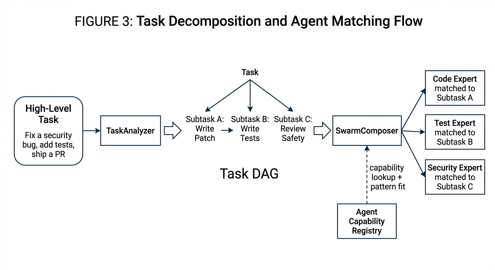

*Figure 3: How a high-level task flows through TaskAnalyzer (decomposition into a DAG of subtasks with dependencies) and SwarmComposer (matching each subtask to the best expert model via capability lookup). This is the first step before any coordination pattern is applied.*

Notice that in Figure 3, each subtask gets its own expert model. The Code Expert writes the patch, the Test Expert writes verification, and the Security Expert reviews for safety. This is the core value of the swarm approach: each model does what it is best at, instead of asking one general model to do everything.

What I plan to do:

- Define core orchestration types and traits like `TaskDescriptor`, `Subtask`, `SwarmPlan`, and `CoordinationPattern` in the right layer, most likely in a new `mofa-orchestrator` crate under the `mofa` repo. I will reuse existing kernel types wherever I can.
- Build `TaskAnalyzer` as a component that takes a high-level task description (plus optional structured hints) and produces a DAG of subtasks with dependencies and rough difficulty ratings. For the first version, this can use a simple LLM prompt strategy and some basic rule-based checks, with the design leaving room for more advanced analyzers later.
- Build `SwarmComposer` to map subtasks to agent roles and individual agents using an agent capability registry. The first version can use a straightforward matching strategy, like tagging agents with capabilities and using a basic scoring function, but the API should allow plugging in smarter matching later. Importantly, SwarmComposer also annotates each subtask with a recommended coordination pattern (see Phase 2 and Figure 6 for how patterns are combined).
- Build a minimal in-memory representation and serialization format for swarm plans, so they can be logged, inspected, and passed to later components.

From a MoFA perspective, this phase is mainly about designing the orchestrator API so it integrates cleanly with existing agent metadata and capability representations, and making the core components testable on their own with artificial agent definitions.

---

##### Phase 2: Coordination Patterns, Debate, and HITL Governor

The goal is to support multiple collaboration modes, prove that multi-expert coordination produces better results than single-expert execution, and implement a basic human-in-the-loop governance flow.

###### Individual Patterns

<!-- FIGURE 4: Coordination Patterns Comparison -->
<!-- IMAGE GENERATION PROMPT:
Create a diagram on a white background showing three coordination patterns side by side, each in its own column. Use simple boxes and arrows.

Column 1 - "Sequential":
- Three boxes stacked vertically: "Code Expert", "Test Expert", "Review Expert"
- Single arrows pointing downward between them
- A label on the first arrow: "patch output"
- A label on the second arrow: "test results"
- A final arrow from Review Expert to a box labeled "Result"
- Caption below: "One at a time. Each expert's output feeds into the next."

Column 2 - "Parallel":
- One box at top labeled "Orchestrator"
- Three arrows fanning out downward to three boxes side by side: "Lint Expert", "Test Expert", "Doc Expert"
- Three arrows from all three experts converging into a box labeled "Aggregator"
- Arrow from Aggregator to "Result"
- Caption below: "All at once. Independent checks run simultaneously, results merged."

Column 3 - "Debate":
- Two boxes side by side at top: "Security Expert", "Performance Expert"
- Curved double-headed arrows between them labeled "propose / counter-propose"
- Below them, an arrow from each expert down to a box labeled "Judge (Test Suite / Constraint Check)"
- Arrow from Judge to "Result"
- Caption below: "Two experts argue. A judge selects the proposal that passes hard constraints."

Keep it flat and clean. Dark grey/black lines on white. Sans-serif font. No decorations.
-->

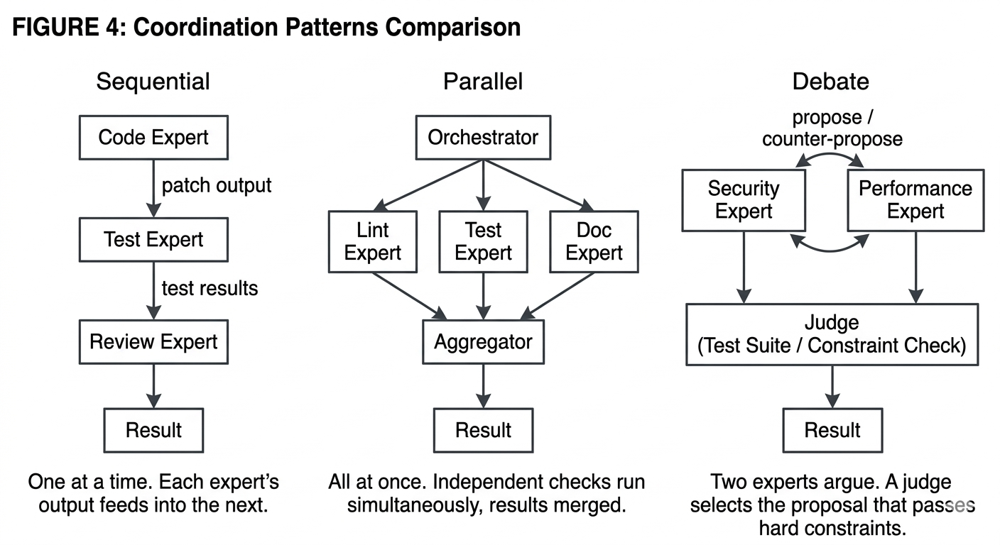

*Figure 4: Three coordination patterns the orchestrator can use. Sequential and Parallel are the MVP targets. Debate is also implemented with mocked experts to validate the multi-expert value proposition. Each pattern uses specialized expert models, not generic ones.*

Figure 4 shows each pattern in isolation. But in practice, the orchestrator does not pick just one pattern for the entire task. Different parts of the same task DAG call for different patterns. The next figure shows how they combine.

###### The Bigger Picture: Combining Patterns on a Task DAG

<!-- FIGURE 5: Combined Patterns on a Task DAG -->
<!-- IMAGE GENERATION PROMPT:
Create a vertical flowchart on a white background showing how multiple coordination patterns are applied to different parts of a single task DAG. Use simple boxes and arrows with clear labels.

At the top, a box labeled "Task: Fix a security bug and ship a safe PR"

Below it, draw the task DAG with these subtasks and groupings:

Group 1 - Sequential (draw a light dashed rectangle around this group, labeled "Sequential"):
- Box "Subtask A: Generate Patch" with label below "Code Expert"
- Arrow down to Box "Subtask B: Write Tests" with label below "Test Expert"
- (B depends on A, so they must be sequential)

Group 2 - Parallel (draw a light dashed rectangle around this group, labeled "Parallel"):
- Three boxes side by side: "Subtask C: Lint Check", "Subtask D: Unit Tests", "Subtask E: Doc Check"
- Labels below each: "Lint Expert", "Test Expert", "Doc Expert"
- An arrow from Group 1 (Subtask B) down to all three boxes (they depend on the patch and tests existing)
- Three arrows from all three converging into a small box "Merge Results"

Group 3 - Debate (draw a light dashed rectangle around this group, labeled "Debate"):
- This group activates only if the task is flagged as high-risk or uncertain
- Two boxes: "Security Expert" and "Performance Expert"
- Double-headed arrow between them labeled "argue tradeoffs"
- Both arrows down to "Judge: constraint checker"
- Arrow from Judge to a diamond labeled "Confidence high?"
- Arrow right from diamond labeled "No" to a box "HITLGovernor (human approval)"
- Arrow down from diamond labeled "Yes" to final box "Ship PR"
- Arrow from HITLGovernor also goes down to "Ship PR"

Keep it clean and readable. Dark lines on white. Use dashed rectangles to group the pattern zones. Sans-serif font. No 3D or shadows.
-->

*Figure 5: The bigger picture. A single task DAG uses Sequential for dependent subtasks, Parallel for independent checks, and Debate for high-risk decisions. The orchestrator picks the right pattern for each section of the DAG, not one pattern for the whole task. If confidence is low after Debate, HITLGovernor takes over.*

This is the core architecture of the coordination engine. The orchestrator reads the task DAG (produced by TaskAnalyzer in Phase 1), looks at each section, and decides:

- **Sequential** when subtasks depend on each other. You cannot write tests before the patch exists.
- **Parallel** when subtasks are independent. Lint checks, unit tests, and doc checks can all run at the same time.
- **Debate** when the decision is high-impact or uncertain, and two different expert perspectives can catch different failure modes. This is where the real value of multi-expert swarms shows up.

Notice how Figure 5 connects back to Figure 3. The TaskAnalyzer produces the DAG, SwarmComposer assigns expert models and pattern hints, and then the coordination engine executes the plan using the right pattern for each section.

###### Why Debate Adds Value (and how we will prove it)

Debate is not useful because two models talk to each other. It is useful because two models that are different in meaningful ways will catch different kinds of mistakes.

Think about it this way: most agent failures are not "completely wrong answer" failures. They are "right-looking answer, wrong action" failures. For example:

1. A model proposes a patch that looks correct but breaks an edge case in the tests.
2. A model suggests a safe change but forgets a corner case that causes a regression.
3. A model optimizes for speed but violates a rate limit or security constraint.

A single expert model might not catch its own blind spots. But if a second expert model with different priorities reviews the same problem, the disagreement between them becomes a signal. The Judge step then resolves that disagreement using hard evidence (like test results or constraint checks), not just by picking whichever answer sounds more confident.

The key: differences between models are what make Debate valuable. If both models think the same way, Debate adds nothing. The value comes from pairing models with genuinely different strengths.

**Real-world example (concrete and tied to Figure 5)**

Task: "Fix an off-by-one bug in a Rust function, keep performance the same."

This task enters the Debate zone in Figure 5 because it involves a tradeoff between correctness and performance.

- Security Expert (Agent A) focuses on boundary conditions. It proposes a fix that is correct but slightly slower because it adds an extra bounds check.
- Performance Expert (Agent B) looks for faster alternatives. It proposes a fix that is faster but accidentally reintroduces the boundary error in a subtle way.
- Judge checks both proposals against hard criteria: "do all unit tests pass?" and "is runtime within 5% of the baseline?" Agent A's proposal passes both. Agent B's proposal fails the test suite. Judge selects Agent A.

If we had used only Agent B (a single expert), we would have shipped a broken patch. The Debate pattern caught the mistake because the two experts disagreed, and the Judge had concrete evidence to resolve the disagreement.

###### Debate Test Cases (directly tied to the Figure 4 Debate column)

Each test below maps to the "Security Expert, Performance Expert, Judge" flow from Figure 4. Each one has a diagram showing exactly what happens step by step.

---

**Test 1: `debate_selects_patch_that_passes_unit_tests`**

<!-- FIGURE 6: Debate Test 1 - Judge selects the passing patch -->
<!-- IMAGE GENERATION PROMPT:
Create a simple horizontal flow diagram on a white background showing Debate Test 1.

On the left side, two boxes stacked vertically:
- Top box: "Agent A (Correctness Expert)" with a small label below: "Proposes Patch A: correct fix, slightly slower"
- Bottom box: "Agent B (Performance Expert)" with a small label below: "Proposes Patch B: fast fix, fails one boundary test"

Both boxes have arrows pointing right toward a central box labeled "Judge" with subtitle "Runs unit test suite"

From the Judge box, two result lines going right:
- Top line (with a checkmark or "PASS" label): "Patch A: all tests pass"
- Bottom line (with an X or "FAIL" label): "Patch B: boundary test fails"

An arrow from Judge to a final box on the far right labeled "Result: Patch A selected"

Below the entire diagram, a small box labeled "Audit Trail" with text: "debate_used=true, judge_rationale=all_tests_passed, rejected=Patch B (test failure)"

Keep it simple, flat, dark lines on white. Sans-serif font. No decorations. Use simple text labels for pass/fail instead of fancy icons.
-->

*Figure 6: Debate Test 1. Agent A proposes a correct but slower fix. Agent B proposes a fast but broken fix. The Judge runs the test suite and selects Patch A because it passes all tests. The audit trail records the rationale.*

Setup:
- Task: "Fix off-by-one bug in function `foo` so all tests pass."
- Agent A (correctness-focused) proposes Patch A: correct but slightly slower.
- Agent B (performance-focused) proposes Patch B: fast but fails one boundary test.
- Judge runs a deterministic test suite check (or mocked equivalent that returns pass/fail).

Expected:
- Judge selects Patch A because it passes all tests.
- Audit trail records: `debate_used=true`, `judge_rationale=all_tests_passed`, `rejected=Patch B (test failure)`.

---

**Test 2: `debate_resolves_safety_vs_performance_tradeoff`**

<!-- FIGURE 7: Debate Test 2 - Judge resolves constraint conflict -->
<!-- IMAGE GENERATION PROMPT:
Create a simple horizontal flow diagram on a white background showing Debate Test 2.

On the left side, two boxes stacked vertically:
- Top box: "Agent A (Safety Expert)" with a small label below: "Proposes conservative solution. Respects rate limit."
- Bottom box: "Agent B (Performance Expert)" with a small label below: "Proposes fast solution. Weakens rate limit condition."

Both boxes have arrows pointing right toward a central box labeled "Judge" with subtitle "Checks two constraints"

From the Judge box, draw two constraint check results stacked vertically:
- "Constraint 1: No rate limit violation"
  - Agent A: "PASS"
  - Agent B: "FAIL"
- "Constraint 2: Latency within threshold"
  - Agent A: "PASS"
  - Agent B: "PASS"

An arrow from Judge to a result box: "Result: Agent A selected (all constraints satisfied)"

Below, a small note: "If NEITHER proposal passes all constraints -> escalate to HITLGovernor (Figure 9)"

Keep it simple, flat, dark lines on white. Sans-serif font.
-->

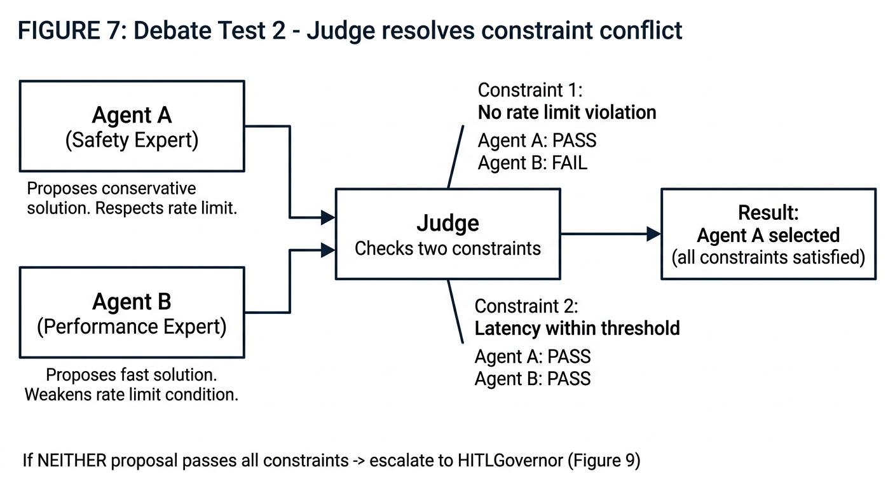

*Figure 7: Debate Test 2. Agent A respects the rate limit. Agent B violates it. The Judge checks both hard constraints and selects Agent A. If neither had passed, the system escalates to HITLGovernor instead of silently picking a risky option.*

Setup:
- Task: "Optimize a service handler but keep a strict rate limit rule."
- Agent A (safety-focused) proposes a conservative solution that respects the rate limit.
- Agent B (performance-focused) proposes a fast solution but weakens the rate limiting condition.
- Judge checks both constraints: "no rate limit violation" and "latency within threshold."

Expected:
- Judge selects Agent A because it satisfies all hard constraints.
- If neither proposal satisfies all constraints, Judge triggers escalation to HITLGovernor (Figure 9), because we should not silently pick a risky option.

---

**Test 3: `debate_detects_shared_blind_spot_and_escalates`**

This test checks what happens when Debate does NOT help, which is just as important.

<!-- FIGURE 8: Debate Test 3 - Shared blind spot triggers escalation -->
<!-- IMAGE GENERATION PROMPT:
Create a simple horizontal flow diagram on a white background showing Debate Test 3 (the failure case).

On the left side, two boxes stacked vertically:
- Top box: "Agent A" with a small label below: "Proposes Solution A. Makes incorrect assumption X."
- Bottom box: "Agent B" with a small label below: "Proposes Solution B. Also makes incorrect assumption X."

Both boxes have arrows pointing right toward a central box labeled "Judge" with subtitle "Compares evidence"

From the Judge box, two result lines:
- "Solution A: fails test Y (because of assumption X)"
- "Solution B: fails test Y (because of assumption X)"

A box below: "Judge verdict: NO CLEAR WINNER. Both fail on the same evidence."

An arrow from this verdict box pointing right to a box labeled "Escalate to HITLGovernor" with subtitle "System admits uncertainty, asks for human help"

Below, a small box labeled "Audit Trail" with text: "debate_used=true, judge_rationale=no_clear_winner, escalated=true"

Keep it simple, flat, dark lines on white. Sans-serif font.
-->

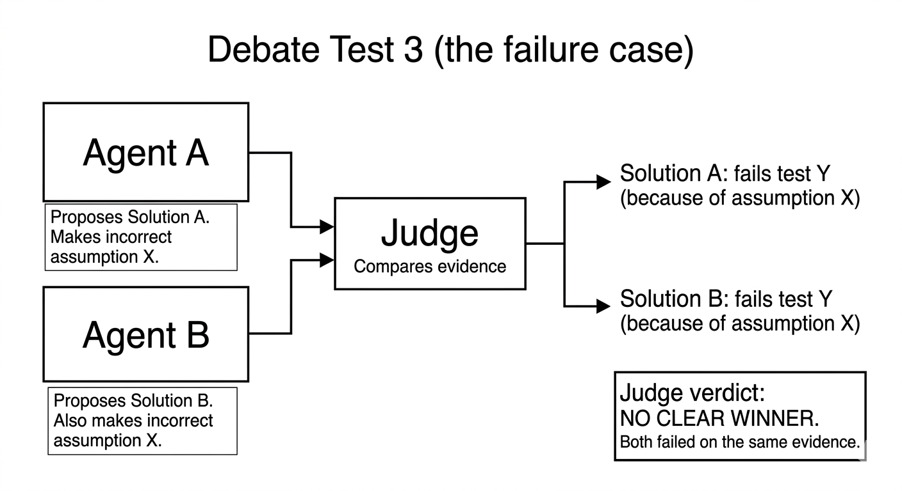

*Figure 8: Debate Test 3. Both experts share the same blind spot. The Judge finds both proposals fail on the same evidence. Instead of picking a winner based on surface reasoning, the system admits uncertainty and escalates to HITLGovernor. This proves the system does not blindly trust Debate.*

Setup:
- Both Agent A and Agent B make the same incorrect assumption (they are wrong in the same way).
- Judge compares their arguments and discovers both lead to the same test failure.

Expected:
- Judge does not declare a winner based on surface reasoning alone.
- Orchestrator triggers the Clarify or Escalate path through HITLGovernor, because the disagreement signal was weak and the evidence says "we still do not know."
- Audit trail records: `debate_used=true`, `judge_rationale=no_clear_winner`, `escalated=true`.

This test is important because it proves the system does not blindly trust Debate. When both experts share a blind spot, the system admits uncertainty and asks for human help.

---

###### Systematic Verification: Proving Swarm is Better Than Single Expert

I will verify the value of multi-expert coordination using a repeatable evaluation process:

<!-- FIGURE 9-A: Verification Comparison Setup -->
<!-- IMAGE GENERATION PROMPT:
Create a diagram on a white background showing three parallel evaluation lanes side by side, each representing a different mode being compared.

At the top, a single box labeled "Same Benchmark Task Set" with three arrows fanning downward to three columns:

Column 1 - "Mode A: Single Expert Baseline":
- One box labeled "General-Purpose Model"
- Arrow down to "Executes alone"
- Arrow down to "Result A"

Column 2 - "Mode B: Swarm without Debate":
- Three small boxes side by side: "Code Expert", "Test Expert", "Review Expert"
- Arrow down to "Sequential + Parallel only"
- Arrow down to "Result B"

Column 3 - "Mode C: Full Swarm with Debate":
- Three small boxes side by side: "Code Expert", "Test Expert", "Review Expert"
- Plus two more boxes below labeled "Security Expert" and "Performance Expert" with a double arrow between them and a "Judge" box below
- Arrow down to "Sequential + Parallel + Debate"
- Arrow down to "Result C"

Below all three columns, a horizontal bar labeled "Compare using metrics:" with four items listed:
- "Success rate (did tests pass?)"
- "Safety (any policy violations?)"
- "Evidence quality (proof signals present?)"
- "Overhead (extra steps / time)"

Keep it simple, flat, dark lines on white. Sans-serif font. Three clear columns.
-->

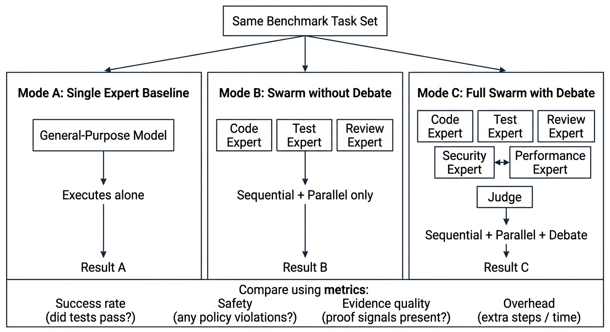

*Figure 9: The three evaluation modes. The same benchmark tasks run through a single expert, a swarm without Debate, and a full swarm with Debate. Results are compared using four measurable metrics. This is how we prove "swarm is better" with evidence instead of just claiming it.*

1. Define a set of benchmark tasks with known success criteria (for example "all unit tests pass", "no permission changes outside workspace", "latency stays within 5% of baseline").

2. Run each task in three modes:
   - **Single-expert baseline**: one general-purpose model handles everything alone.
   - **Swarm without Debate**: multiple experts coordinate using Sequential and Parallel only.
   - **Full swarm with Debate**: Sequential and Parallel for the DAG structure, plus Debate where the system marks a decision as uncertain or high-risk.

3. Compare results using measurable metrics:
   - **Success rate**: did the task meet its acceptance criteria?
   - **Safety**: did the system violate any action safety rules (see Figure 15 later)?
   - **Evidence quality**: does the final answer include proof signals (like "test report says all green")?
   - **Overhead**: how many extra steps did Debate add, and how much extra time it cost?

If Debate improves success rate without unacceptable overhead, we have a defensible, evidence-based reason to prefer it for certain categories of subtasks. If it does not help, we know to skip Debate for those task types. Either way, the result is useful.

---

###### What I Plan to Build in Phase 2

- Implement Sequential and Parallel coordination patterns as the MVP. Each pattern defines how subtasks are scheduled, how results get combined, and when errors trigger retries or escalations.
- Implement the Debate coordination pattern end to end using mocked expert models in the first iteration. The core flow is: Agent A and Agent B propose different solutions, the Judge selects based on deterministic evaluation criteria (test pass/fail, constraint checks, safety policy results).
- Add the three Debate test cases (Figures 6, 7, 8) to validate Judge behavior and to prove that multi-expert coordination is better than single-expert for the same task set.
- Design a small internal DSL or configuration structure to describe which pattern should be used for each section of the DAG (as shown in Figure 5), so TaskAnalyzer and SwarmComposer can include pattern hints.
- Implement `HITLGovernor` following the five-phase secretary model from the idea text, with clear state transitions for Receive, Clarify, Schedule, Monitor, and Report.
- Connect coordination patterns with HITL, so patterns know when a decision needs human approval, and HITLGovernor knows what context to assemble and how to pause and resume execution. This includes the escalation path from Debate (Test 3, Figure 8) and the action safety path (covered in detail after Figure 15).

<!-- FIGURE 10: HITLGovernor State Machine -->
<!-- IMAGE GENERATION PROMPT:
Create a state machine diagram on a white background showing the five phases of the HITLGovernor lifecycle.

Draw five rounded rectangles arranged in a roughly circular flow:
1. "Receive" - labeled "Incoming task or escalation arrives"
2. "Clarify" - labeled "Gather context, ask clarifying questions if needed"
3. "Schedule" - labeled "Queue for human review, set priority and deadline"
4. "Monitor" - labeled "Wait for human decision, track SLA timeout"
5. "Report" - labeled "Deliver decision back, log in audit trail"

Draw arrows between them showing the normal flow: Receive -> Clarify -> Schedule -> Monitor -> Report

Add three extra arrows:
- From "Monitor" back to "Clarify" labeled "needs more info"
- From "Monitor" to a small box labeled "Escalate" with an arrow labeled "SLA timeout"
- From "Report" to a label "resume orchestration" with an arrow pointing out of the diagram (back to the coordination engine)

Add two entry points into "Receive" with small labels:
- "from Debate (weak evidence, Fig 8)" pointing into Receive
- "from Action Safety (risky action, Fig 15)" pointing into Receive

Keep it simple, use thin black lines on white background. Sans-serif font. No shadows or 3D effects.
-->

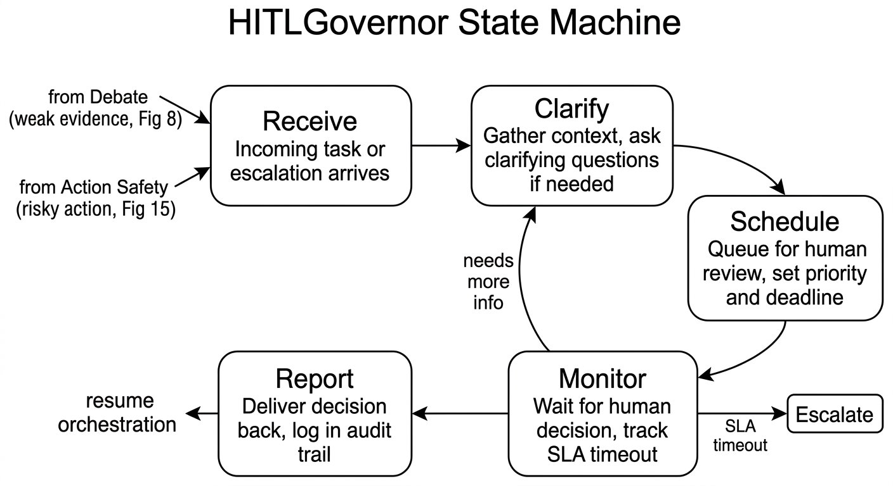

*Figure 10: The five-phase lifecycle of HITLGovernor. Notice the two entry points: one from Debate (when evidence is weak, as in Test 3 / Figure 8) and one from Action Safety (when a risky action is detected, covered in Figure 15). Tasks can loop back to Clarify if more info is needed, or escalate if the SLA timeout is hit.*

---

##### Phase 3: Governance Layer and Ecosystem Integration

The goal is to add governance and plug the orchestrator into the wider MoFA ecosystem.

I will build governance in two steps. First the core data model (what we record and why), then the I/O wiring (where we send it).

**Step 1: Core governance objects**

- `AuditEvent` records "what happened" at each decision point. For example: agent selected, pattern chosen, HITL approval granted, subtask completed, Debate judge rationale.
- `SLAState` tracks "what deadline applies" and "are we still within bounds."
- `DecisionRecord` captures "what decision was made," plus the reason and the risk level.

These objects are defined first, independently from any storage or notification backend, so they can be tested in isolation.

**Step 2: I/O wiring**

After the core objects are clear, I will connect them to their output destinations:

- Persistent audit storage (using existing MoFA persistence abstractions).
- Escalation and alert channel when an SLA is violated.
- MoFA Smith / Observatory for structured traces and metrics.
- Notification adapters for external systems.

<!-- FIGURE 11: Governance Layer Data Flow -->
<!-- IMAGE GENERATION PROMPT:
Create a vertical data flow diagram on a white background showing governance data flow in two clear steps.

Step 1 - Core Objects (top section, draw a dashed rectangle around it labeled "Step 1: Core Governance Objects"):
- A box at the top labeled "Swarm Orchestrator (running a task)"
- Three arrows going down from it to three boxes in a row:
  - "AuditEvent" with small examples below: "agent selected, pattern chosen, HITL approval, debate rationale"
  - "SLAState" with small examples below: "deadline, current status, violation flag"
  - "DecisionRecord" with small examples below: "decision made, reason, risk level"

Step 2 - I/O Outputs (bottom section, draw a dashed rectangle around it labeled "Step 2: I/O Wiring"):
- From AuditEvent, an arrow down to a cylinder/database labeled "Audit Store (persistence)"
- From SLAState, an arrow down to a box labeled "Escalation / Alert Channel"
- From DecisionRecord, an arrow down to a box labeled "MoFA Smith / Observatory (traces + metrics)"
- A fourth box on the right labeled "Notification Router" with three small arrows fanning out to: "Webhook", "Console/Log", "Email (future)"
- A dashed arrow from all three core objects to the Notification Router

Keep it clean, thin dark lines on white, sans-serif font. The two-step structure should be visually clear.
-->

*Figure 11: Governance data flow in two steps. Step 1 defines the core objects (AuditEvent, SLAState, DecisionRecord) independently. Step 2 wires them to storage, alerting, Smith, and notification adapters. This separation makes testing easier and keeps the core model clean.*

What I plan to do:

- Implement the core governance objects and make sure they capture all the decision points from Figures 4, 5, 6, 7, 8, and 10, including Debate outcomes, HITL approvals, and action safety decisions.
- Implement multi-channel notification adapters. At first, the focus is on defining the interface and providing one or two simple adapters (webhook and console/log) that others can extend.
- Integrate with MoFA Gateway by using capability APIs instead of hardcoding protocol details inside orchestrator components.
- Integrate with MoFA Smith or Observatory by emitting the structured AuditEvent and DecisionRecord data as traces and metrics for swarm runs.

---

##### Phase 4: SDK Integration and Developer-Facing APIs

The goal is to expose orchestrator functionality through MoFA SDK in a way that developers can actually pick up and use.

What I plan to do:

- Add high-level SDK functions and types that let user code define orchestrated tasks, submit them to the Swarm Orchestrator, and observe or wait for results. This might include simplified builder APIs for common patterns.
- Make sure the orchestrator APIs are accessible from the FFI layer, so languages like Python, Go, Kotlin, or Swift can trigger and interact with swarms using the same abstractions.
- Provide at least one example project that shows how a developer would use the Swarm Orchestrator in a realistic scenario, like the "fix a security bug and ship a PR" workflow from Figure 5.

The focus here is on ergonomics and clarity. The implementation underneath should stay aligned with the kernel and foundation contracts, but the public surface should feel approachable to someone who is not deeply familiar with the internals.

---

##### Phase 5: Plugin Marketplace Core and Semantic Agent Discovery

The goal is to implement the core of the plugin marketplace and semantic discovery capabilities from the idea text.

<!-- FIGURE 12: Semantic Agent Discovery with Pattern Awareness -->
<!-- IMAGE GENERATION PROMPT:
Create a technical diagram on a white background showing the semantic agent discovery system with pattern awareness.

On the left side, draw a box labeled "Orchestrator Query" with two example lines inside:
- Line 1: "I need an agent that can write unit tests for Rust code"
- Line 2: "Must support: Debate (as Judge or Participant)"

An arrow goes right from this box to a box labeled "Embedding Model" which converts the query to a vector.

Another arrow goes right to a large rounded rectangle labeled "Capability Registry" containing a small table with these columns: Name, Capabilities, Supported Patterns, Trust Score. Example rows:
- "rust-test-agent | [rust, testing, unit-tests] | [Sequential, Debate-Judge] | 4.2"
- "python-lint-agent | [python, linting] | [Parallel] | 3.8"
- "security-review-agent | [security, review, permissions] | [Debate-Participant, Sequential] | 4.5"
- "code-gen-agent | [rust, code-generation, patching] | [Sequential, Debate-Participant] | 4.1"

An arrow goes from the registry to a box labeled "Match + Rank" with two sub-labels:
- "1. Semantic similarity (capabilities match query)"
- "2. Pattern fit (agent supports the required coordination pattern)"

An arrow from "Match + Rank" to a final box labeled "Top Matches" listing:
- "#1 rust-test-agent (capability match + Debate-Judge support)"
- "#2 security-review-agent (partial capability match + Debate-Participant)"

Below the registry, draw a small box labeled "Plugin Registry (SemVer, dependencies, conflict detection)" connected with a dashed line to the Capability Registry.

Simple flat style, dark lines on white, sans-serif font.
-->

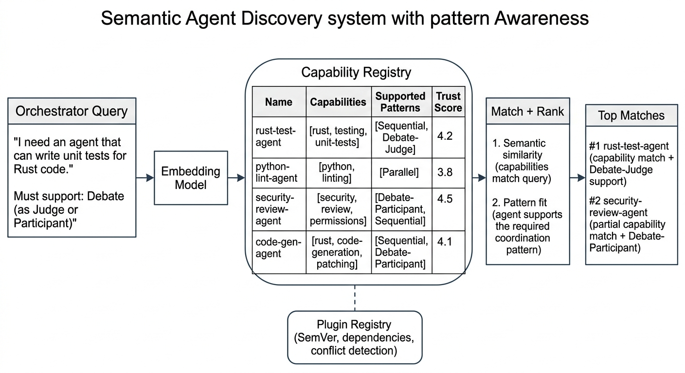

*Figure 12: How the orchestrator finds the right expert models for a task. The registry stores not just what each agent can do (capabilities), but also which coordination patterns it supports (Sequential, Parallel, Debate-Judge, Debate-Participant). The ranking considers both semantic match and pattern fit.*

Figure 12 connects directly back to Figures 4 and 5. For the Debate pattern in Figure 4 to work, the orchestrator needs to find agents that can actually participate in Debate. A "rust-test-agent" that supports the Debate-Judge role can serve as the Judge in Figure 4's Debate column. A "security-review-agent" that supports Debate-Participant can serve as one of the arguing experts.

Without this pattern-aware discovery, SwarmComposer from Figure 3 would have no way to know which agents are suitable for which coordination roles. It would be stuck doing basic keyword matching, which is not enough when you need specific Debate participants or a reliable Judge.

What I plan to do:

- Make the capability registry store `supported_patterns` alongside normal capabilities. This way SwarmComposer can ask for "agents that support Debate-Judge" and not just "agents that can write tests."
- Implement a basic plugin registry data model with SemVer-compatible dependency resolution and conflict detection.
- Implement trust scoring fields and hooks, like ratings, download counts, or security flags, even if the full scoring logic stays simple for now.
- Implement semantic search over agents using embeddings, so the orchestrator can find suitable agents from text descriptions of tasks, then rank them by both semantic match and pattern fit.
- Provide a minimal HTTP or CLI interface for searching and inspecting agent capabilities.

Given the time available, this phase will prioritize a correct and extensible core over a feature-complete marketplace.

---

### End-to-End Orchestration Flow

To tie all the phases together, here is how a complete task flows through the system from start to finish. Every box in this diagram maps to a component described in the phases above.

<!-- FIGURE 13: End-to-End Orchestration Flow -->
<!-- IMAGE GENERATION PROMPT:
Create a detailed vertical flowchart on a white background showing the full lifecycle of a task through the Swarm Orchestrator. Use simple boxes and arrows, going from top to bottom.

Step 1: Box labeled "Developer submits task via SDK" at the top
  Arrow down

Step 2: Box labeled "TaskAnalyzer (Fig 3)" with subtitle "Decomposes task into subtask DAG"
  Arrow down

Step 3: Box labeled "SwarmComposer (Fig 3, 12)" with subtitle "Matches subtasks to expert models via Capability Registry. Annotates each DAG section with a coordination pattern."
  Arrow down

Step 4: Box labeled "Action Safety Check (Fig 15)" with subtitle "Classifies planned actions by risk level"
  Arrow down to a diamond

Step 5: Diamond (decision shape) labeled "Risky action or uncertain decision?"
  Arrow right labeled "Yes" to a box labeled "HITLGovernor (Fig 10)" with subtitle "Receive -> Clarify -> Schedule -> Monitor -> Report"
  Arrow from HITLGovernor curving back down to rejoin the main flow
  Arrow down from diamond labeled "No"

Step 6: Box labeled "Coordination Engine (Fig 4, 5)" with subtitle "Executes DAG using combined patterns: Sequential, Parallel, Debate"
  Small side arrow to the right going to a box labeled "MoFA Gateway" with subtitle "Tool/capability access"
  Small side arrow to the left going to a box labeled "GovernanceLayer (Fig 11)" with subtitle "AuditEvents, SLAs, DecisionRecords"
  Arrow down

Step 7: Box labeled "Result Aggregation + Verification"
  Small side arrow to the right going to a box labeled "MoFA Smith" with subtitle "Traces and metrics emitted"
  Arrow down

Step 8: Box labeled "Result returned to developer via SDK"

Keep it clean and readable. Dark lines on white. Sans-serif font. No 3D, no shadows. Include the figure cross-references in the subtitle text.
-->

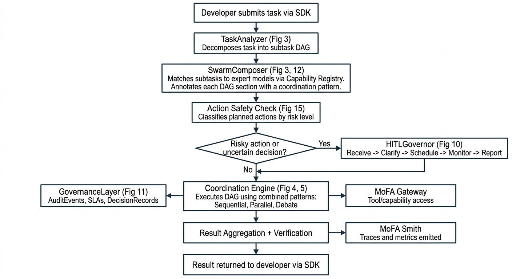

*Figure 13: The full lifecycle of a task, from submission through decomposition, expert matching, action safety check, optional human approval, coordinated execution with combined patterns, and result delivery. Each step references the figure where that component is described in detail.*

---

### Action Safety: How We Decide What Needs Human Verification

Human approvals only help if the system asks for them at the right moments. The key is a policy that classifies actions by risk, so safe automation stays smooth while dangerous automation requires a real human check.

This matters because the agents in our swarm do not just produce text. They can plan and execute real actions: writing files, deleting directories, changing permissions, running commands. On Linux and Unix systems, these actions have very different risk levels depending on what they touch.

#### How Linux/UNIX Permissions and Actions Create Risk

On Linux and Unix systems, every file and directory has permissions that control who can read, write, or execute it. These are usually shown as three groups of three bits (like `rwxr-xr-x` or the numeric form `755`). When an agent wants to change a file or run a command, the risk depends on several things:

- **What kind of action is it?** Reading is safe. Writing inside your own workspace is usually fine. Deleting things is destructive. Changing permissions can open security holes. Running things with `sudo` gives root access to the system.
- **Where does the action target?** Your project folder (`./src/`) is your workspace. System paths like `/etc/` (configuration files), `/usr/bin/` (system binaries), and `/var/` (variable data, logs, databases) are shared by the whole operating system. Touching them can break other software or the entire system.
- **How much do permissions change?** Going from `755` to `777` means you are opening write access to everyone. Going from `644` to `600` means you are restricting access. The direction matters.

The orchestrator needs to understand these distinctions to make good decisions about when to ask for human approval.

<!-- FIGURE 14: Linux Permission Risk Zones -->
<!-- IMAGE GENERATION PROMPT:
Create a simple diagram on a white background showing a file system tree with risk zones highlighted.

Draw a simplified Linux filesystem tree:

Root "/" at the top with branches going down to:
- "/etc/" labeled "System config (HIGH RISK)"
- "/usr/bin/" labeled "System binaries (HIGH RISK)"
- "/var/" labeled "System data, logs (HIGH RISK)"
- "/home/user/project/" labeled "User workspace (LOW RISK)" with sub-branches:
  - "/home/user/project/src/" labeled "Source code"
  - "/home/user/project/tests/" labeled "Test files"
  - "/home/user/project/production/" labeled "Production config (USER-DEFINED RISK)"
- "/tmp/" labeled "Temporary (LOW RISK)"

Use color coding with simple labels:
- System paths (/etc, /usr/bin, /var): draw with a slightly thicker line or different shade, labeled "Requires HITL approval"
- Workspace paths: normal lines, labeled "Auto-approve (usually)"
- User-defined special paths (production/): dashed line, labeled "User-configured rule"

Keep it simple, like a student's filesystem diagram. Dark lines on white. Sans-serif font. No fancy icons.
-->

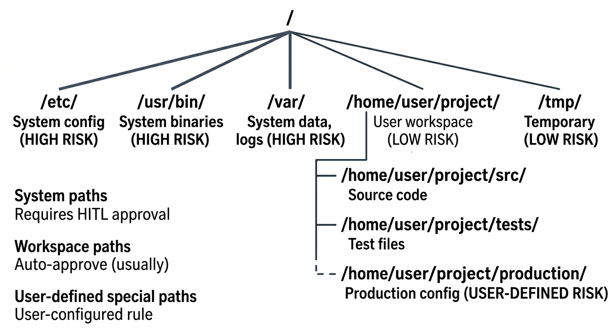

*Figure 14: Where actions happen on the filesystem determines their risk level. System paths like /etc and /usr/bin always require human approval. Workspace paths are usually safe. Users can add custom rules for paths like production/.*

#### The Action Safety Classification Policy

<!-- FIGURE 15: Action Safety Decision Tree -->
<!-- IMAGE GENERATION PROMPT:
Create a decision tree / flowchart on a white background showing how the orchestrator classifies actions by safety level.

Start with a box at the top labeled "Planned Action from Agent"

Arrow down to first diamond: "Is it read-only? (list dir, read file, check metadata)"
- Arrow right labeled "Yes" to a green-tinted box labeled "SAFE - Auto-approve, log in audit trail"
- Arrow down labeled "No"

Second diamond: "Is it a write inside the allowed project workspace?"
- Arrow right labeled "Yes" to a light-yellow-tinted box labeled "LOW RISK - Auto-approve, log in audit trail"
- Arrow down labeled "No"

Third diamond: "Is it a delete operation?"
- Arrow right labeled "Yes" to an orange-tinted box labeled "DESTRUCTIVE - Require HITL approval before execution"
- Arrow down labeled "No"

Fourth diamond: "Does it change permissions or ownership? (chmod, chown)"
- Arrow right labeled "Yes" to a red-tinted box labeled "HIGH RISK - Require HITL approval. Log permission delta."
- Arrow down labeled "No"

Fifth diamond: "Does it use elevated privileges? (sudo, system paths like /etc, /usr, /var)"
- Arrow right labeled "Yes" to a dark-red-tinted box labeled "CRITICAL - Require HITL approval. Escalate if SLA timeout."
- Arrow down labeled "No" to a box labeled "MEDIUM RISK - Apply user-configured rules or default to HITL approval"

On the right side, draw a bracket connecting all the "Require HITL approval" boxes to a label "Entry point into HITLGovernor (Figure 10)"

Keep it clean and simple. Use very subtle color tints (not bright). Dark lines on white. Sans-serif font.
-->

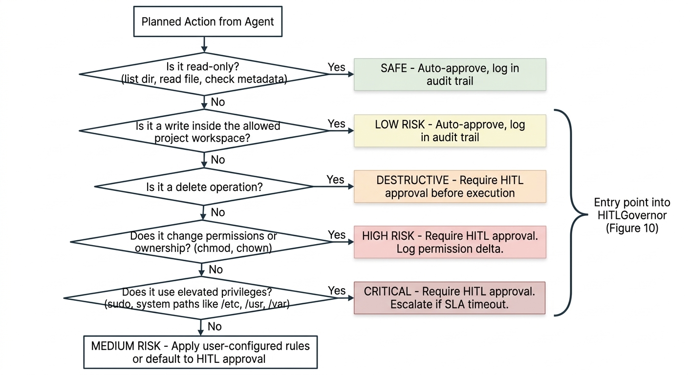

*Figure 15: Decision tree for classifying planned actions by risk level. Read-only and workspace writes are auto-approved. Deletes, permission changes, and privileged commands require human approval through HITLGovernor (Figure 10). This drives the "Risky action?" decision in the end-to-end flow (Figure 13).*

The classification uses these signals:

- **Action type**: read-only vs write vs delete vs chmod/chown vs privileged execution. Each has a different base risk level.
- **Target path**: workspace path or sensitive system path? (See Figure 14)
- **Permission delta**: does the change increase permissions (like `755` to `777`)? The before and after states are compared.
- **Size of change**: small single-file edits vs mass deletes or rewrites of many files.
- **User-configured rules**: custom rules the user defines for their environment (like "always require approval for writes to `production/`").

When the policy triggers an approval request, execution pauses at the HITLGovernor "Schedule" and "Monitor" phases (Figure 10), and resumes only after the human decision comes back.

---

#### Action Safety Test Cases (tied to Figure 15)

Each test has a diagram showing the specific action, the policy decision path, and the expected result.

---

**Test 4: `auto_approve_read_only_action`**

<!-- FIGURE 16: Action Safety Test 4 - Read-only auto-approve -->
<!-- IMAGE GENERATION PROMPT:
Create a simple three-step vertical flow diagram on a white background.

Step 1: Box at top labeled "Agent plans:" with text below: "list contents of ./src/" and "read ./src/main.rs"

Arrow down

Step 2: Box labeled "Policy Check" with the question: "Is it read-only?" and the answer: "YES - listing and reading do not modify anything"

Arrow down

Step 3: Box with a subtle green tint labeled "Result: AUTO-APPROVE" with text below:
- "Orchestrator proceeds without HITL"
- "Audit trail: risk_level=safe, approval=auto"

Keep it simple, flat, three boxes with arrows. Dark lines on white. Sans-serif font. Very subtle green tint on the result box.
-->

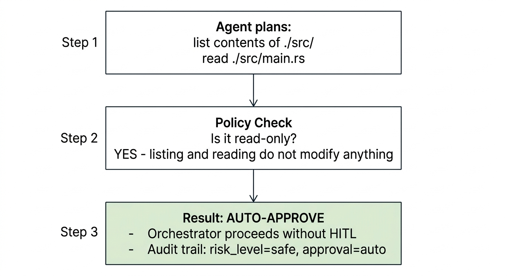

*Figure 16: Test 4. Reading files and listing directories are safe actions. The policy auto-approves and logs them.*

Setup:
- Agent plans to list the contents of `./src/` and read `./src/main.rs`.

Expected:
- Policy classifies both actions as "read-only" (top of Figure 15).
- Orchestrator proceeds without HITL approval.
- Audit trail records both actions with `risk_level=safe`, `approval=auto`.

---

**Test 5: `auto_approve_workspace_write`**

<!-- FIGURE 17: Action Safety Test 5 - Workspace write auto-approve -->
<!-- IMAGE GENERATION PROMPT:
Create a simple three-step vertical flow diagram on a white background.

Step 1: Box at top labeled "Agent plans:" with text below: "create new file ./src/tests/new_test.rs"

Arrow down

Step 2: Box labeled "Policy Check" with two questions stacked:
- "Is it read-only? NO"
- "Is it a write inside allowed workspace? YES - ./src/tests/ is inside project directory"

Arrow down

Step 3: Box with a subtle yellow tint labeled "Result: AUTO-APPROVE (LOW RISK)" with text below:
- "Orchestrator proceeds without HITL"
- "Audit trail: risk_level=low, approval=auto, path=./src/tests/new_test.rs"

Keep it simple, flat, three boxes with arrows. Dark lines on white. Sans-serif font. Very subtle yellow tint on the result box.
-->

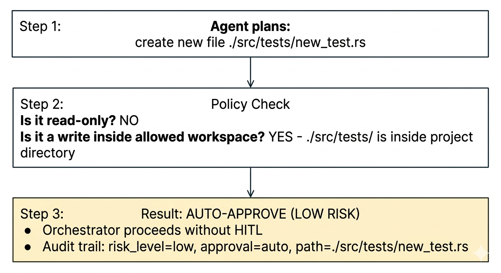

*Figure 17: Test 5. Creating a file inside the project workspace is low risk. The policy auto-approves but still records the action in the audit trail.*

Setup:
- Agent plans to create a new file `./src/tests/new_test.rs` inside the allowed project workspace.

Expected:
- Policy classifies it as "workspace write" (second level of Figure 15).
- Orchestrator proceeds without HITL approval.
- Audit trail records: `risk_level=low`, `approval=auto`, `path=./src/tests/new_test.rs`.

---

**Test 6: `require_approval_for_delete`**

<!-- FIGURE 18: Action Safety Test 6 - Delete requires approval -->
<!-- IMAGE GENERATION PROMPT:
Create a simple four-step vertical flow diagram on a white background.

Step 1: Box at top labeled "Agent plans:" with text below: "delete directory ./data/important_results/"

Arrow down

Step 2: Box labeled "Policy Check" with three questions stacked:
- "Is it read-only? NO"
- "Is it a workspace write? NO - it is a delete"
- "Is it a delete operation? YES"

Arrow down

Step 3: Box with a subtle orange tint labeled "Result: DESTRUCTIVE - REQUIRE HITL APPROVAL" with text below:
- "Execution PAUSES"
- "HITLGovernor receives request with context:"
- "  - What: delete ./data/important_results/"
- "  - Why: agent reasoning"
- "  - Consequence: data loss, not recoverable"

Arrow down

Step 4: Box labeled "After human decision:" with two branches:
- "Approved -> orchestrator resumes, deletes directory"
- "Rejected -> orchestrator skips action, logs rejection"

Below: "Audit trail: risk_level=destructive, approval=pending -> granted/rejected"

Keep it simple, flat. Dark lines on white. Sans-serif font. Subtle orange tint on the HITL box.
-->

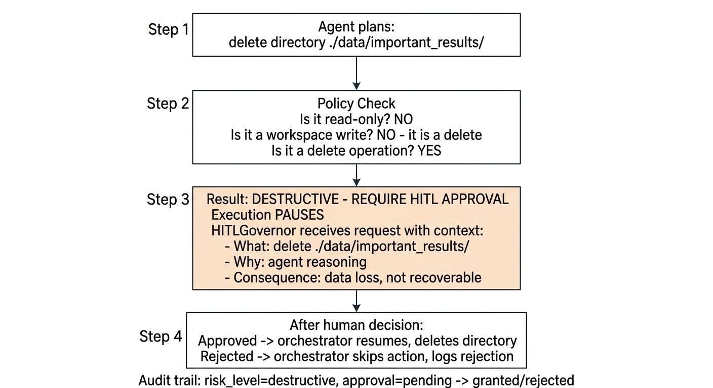

*Figure 18: Test 6. Deleting a data directory is destructive. The system pauses, sends context to a human, and waits for a decision before proceeding.*

Setup:
- Agent plans to delete `./data/important_results/` (a directory outside temporary/trash areas).

Expected:
- Policy classifies it as "destructive" (third level of Figure 15).
- HITLGovernor receives the approval request with context: what is being deleted, why the agent wants to delete it, and what the consequences are.
- Execution pauses until human approves or rejects.
- Audit trail records: `risk_level=destructive`, `approval=pending`, then `approval=granted` or `approval=rejected`.

---

**Test 7: `require_approval_for_chmod`**

<!-- FIGURE 19: Action Safety Test 7 - Permission change requires approval -->
<!-- IMAGE GENERATION PROMPT:
Create a simple four-step vertical flow diagram on a white background.

Step 1: Box at top labeled "Agent plans:" with text below: "chmod 777 /usr/bin/some_tool"

Arrow down

Step 2: Box labeled "Policy Check" with stacked checks:
- "Is it read-only? NO"
- "Is it a workspace write? NO - target is /usr/bin/ (system path)"
- "Is it a delete? NO"
- "Does it change permissions? YES"
- "Permission delta: 755 -> 777 (adds write access for everyone)"
- "Target: /usr/bin/ (system binary directory, see Fig 14)"

Arrow down

Step 3: Box with a subtle red tint labeled "Result: HIGH RISK - REQUIRE HITL APPROVAL" with text below:
- "Execution PAUSES"
- "HITLGovernor receives request with context:"
- "  - Action: chmod"
- "  - Target: /usr/bin/some_tool"
- "  - Before: 755 (rwxr-xr-x)"
- "  - After: 777 (rwxrwxrwx)"
- "  - Risk: opens write access to system binary"

Arrow down

Step 4: "Audit trail: risk_level=high, permission_delta=755_to_777, target=/usr/bin/some_tool"

Keep it simple, flat. Dark lines on white. Sans-serif font. Subtle red tint on the HITL box.
-->

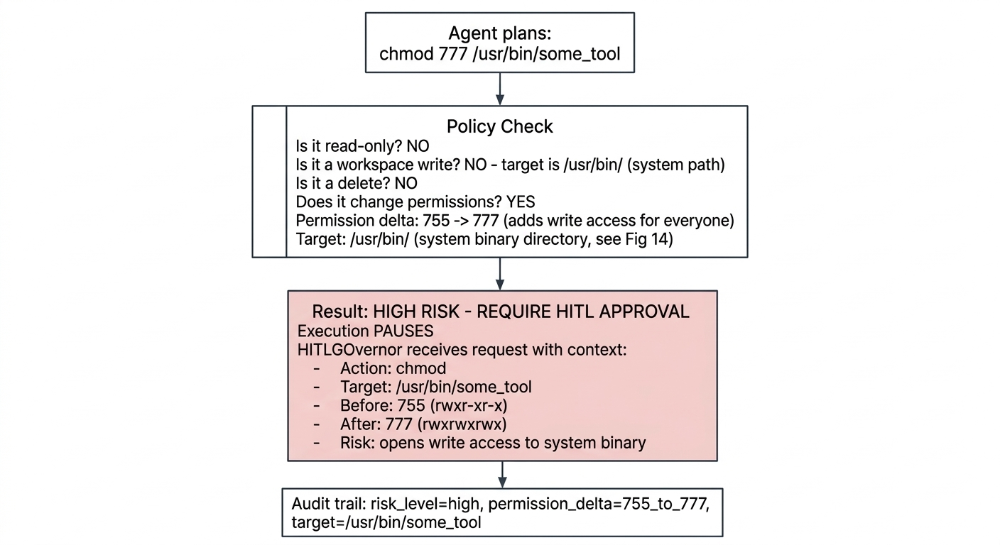

*Figure 19: Test 7. Changing permissions on a system binary from 755 to 777 is high risk. The system shows the human exactly what permissions will change and where, so they can make an informed decision.*

Setup:
- Agent plans to run `chmod 777 /usr/bin/some_tool`.

Expected:
- Policy classifies it as "high risk" because it changes permissions AND targets a system path outside the workspace.
- HITLGovernor receives the approval request with context: current permissions (755), planned permissions (777), target path, and the permission delta.
- Audit trail records: `risk_level=high`, `permission_delta=from_755_to_777`, `target=/usr/bin/some_tool`.

---

**Test 8: `require_approval_for_sudo`**

<!-- FIGURE 20: Action Safety Test 8 - Privilege escalation requires approval -->
<!-- IMAGE GENERATION PROMPT:
Create a simple four-step vertical flow diagram on a white background.

Step 1: Box at top labeled "Agent plans:" with text below: "sudo systemctl restart nginx" or "write to /etc/nginx/nginx.conf"

Arrow down

Step 2: Box labeled "Policy Check" with stacked checks:
- "Is it read-only? NO"
- "Is it a workspace write? NO"
- "Is it a delete? NO"
- "Does it change permissions? NO"
- "Does it use elevated privileges? YES - sudo / system path /etc/"
- "Target: /etc/nginx/ (system config, see Fig 14)"

Arrow down

Step 3: Box with a dark red tint labeled "Result: CRITICAL - REQUIRE HITL APPROVAL" with text below:
- "Execution PAUSES"
- "HITLGovernor receives request with FULL context"
- "If no human responds within SLA timeout:"
- "  -> ESCALATE (do NOT proceed silently)"
- "  -> See Figure 10 escalation path"

Arrow down

Step 4: "Audit trail: risk_level=critical, action=sudo/system_write, target=/etc/nginx/"

Keep it simple, flat. Dark lines on white. Sans-serif font. Subtle dark red tint on the HITL box.
-->

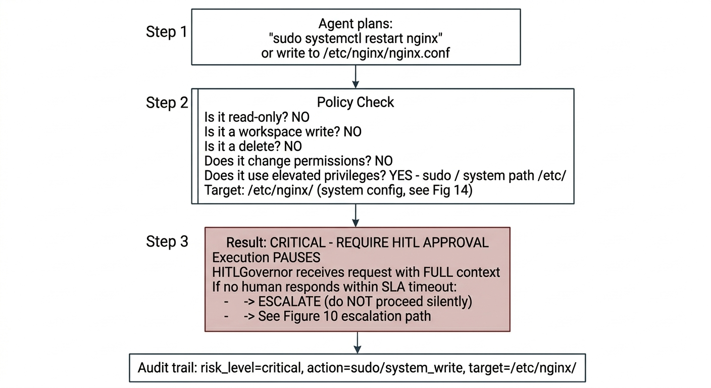

*Figure 20: Test 8. Privilege escalation (sudo) or writing to system config paths is critical risk. If no human responds within the SLA timeout, the system escalates instead of proceeding silently.*

Setup:
- Agent plans to execute a command with `sudo` or modify a file in `/etc/`.

Expected:
- Policy classifies it as "critical" (bottom of Figure 15).
- HITLGovernor receives the request with full context.
- If the SLA timeout is hit without a human response, the system escalates (as shown in Figure 10) rather than proceeding.

---

**Test 9: `user_configured_rule_overrides_default`**

<!-- FIGURE 21: Action Safety Test 9 - User rule overrides default -->
<!-- IMAGE GENERATION PROMPT:
Create a simple four-step vertical flow diagram on a white background showing how a user-configured rule overrides the default policy.

Step 1: Box at top labeled "Agent plans:" with text below: "write to ./production/config.yaml"

Arrow down

Step 2: Box labeled "Default Policy Check" with result:
- "Is it a write inside allowed workspace? YES"
- "Default verdict: LOW RISK - auto-approve"

Arrow down (but with a big "X" or "OVERRIDE" label crossing this arrow)

Step 3: Box labeled "User-Configured Rule Check" with text:
- "Rule: 'always require approval for writes to production/'"
- "Match: ./production/config.yaml matches production/"
- "Override: user rule takes priority over default policy"

Arrow down

Step 4: Box with a subtle orange tint labeled "Result: USER-CONFIGURED - REQUIRE HITL APPROVAL" with text below:
- "Execution PAUSES (even though default would auto-approve)"
- "HITLGovernor receives request"
- "Audit trail: risk_level=user_configured, rule=production_write_requires_approval"

Keep it simple, flat. Dark lines on white. Sans-serif font. Make the override visually clear.
-->

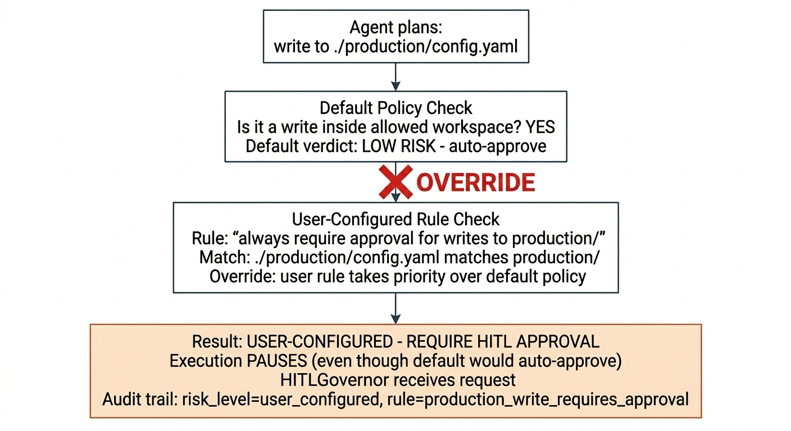

*Figure 21: Test 9. The default policy would auto-approve a workspace write. But the user configured a rule that requires approval for any write to production/. The user rule overrides the default, and the system asks for human approval.*

Setup:
- User has configured a rule: "always require approval for writes to `production/`."
- Agent plans to write to `./production/config.yaml` (which is inside the workspace, so the default policy would auto-approve it).

Expected:
- The user-configured rule overrides the default "workspace write = auto-approve" behavior.
- HITLGovernor receives the approval request.
- Audit trail records: `risk_level=user_configured`, `rule=production_write_requires_approval`.

---

These action safety tests, together with the Debate tests (Figures 6, 7, 8), form the core of the automated test suite that validates the orchestrator's safety behavior end to end.

---
