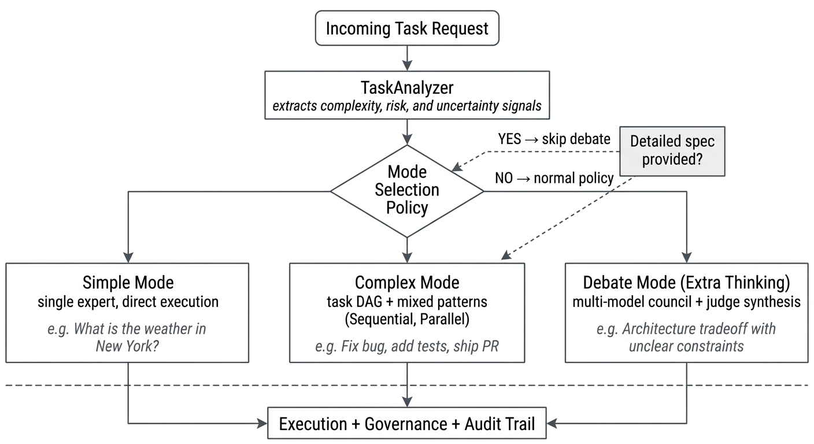
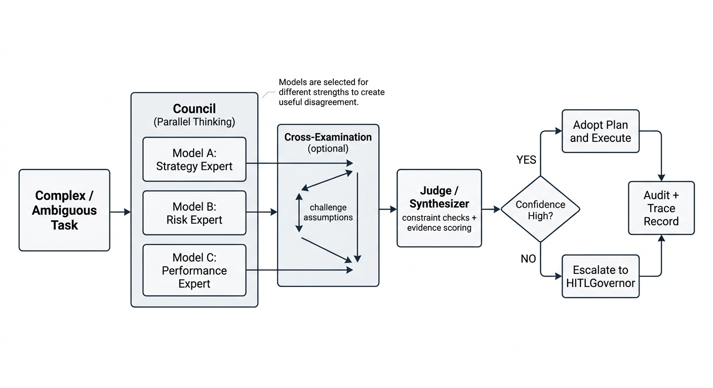
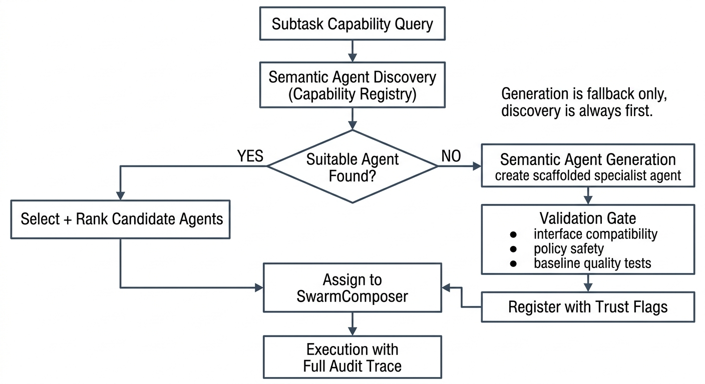

# Cognitive Swarm Orchestrator for MoFA: A Governance-Focused Multi-Agent Collaboration Engine

### Technical Approach

#### Understanding of MoFA Architecture

My current understanding is that MoFA is structured as a microkernel-based Rust framework with a clear separation between layers.

*Figure 1: How MoFA is organized into layers. The Swarm Orchestrator will span kernel, foundation, and runtime, with public APIs surfaced through the SDK.*

The layers break down like this:

- `mofa-kernel`: core traits, types, and contracts for agents, messaging, storage, workflows, gateway, and more.
- `mofa-foundation`: concrete, production-oriented implementations of those contracts, like orchestration helpers, persistence, secretary agents, and coordination utilities.
- `mofa-runtime`: lifecycle and execution management, including SimpleRuntime and optional Dora-based distributed execution.
- `mofa-sdk`: the curated public API that re-exports kernel, foundation, and runtime types for end users and foreign language bindings.

Idea 5 describes the Cognitive Swarm Orchestrator as the brain of this ecosystem. It does not execute business logic itself. Instead, it analyzes incoming tasks, breaks them into subtasks, matches agents based on their capabilities, picks coordination patterns, and then uses existing MoFA components to actually execute and observe those flows. The key insight is that different parts of a task benefit from different expert models, and the orchestrator's job is to assign the right expert to each part and coordinate them using the right pattern.

It connects with:

- **Gateway** for capability access to tools, devices, and external APIs. In current MoFA this is already a major platform layer, including routing, rate control, observability hooks, and distributed control-plane concerns. Gateway is not a small add-on; it is a large-scale subsystem that the orchestrator treats as a first-class integration surface for reaching any external capability an agent might need.
- **Smith / Observatory** for traces, metrics, and evaluation of swarm runs.
- **SDK** for polyglot users to call into orchestrated swarms from other languages.

*Figure 2: How the Swarm Orchestrator connects to Gateway, Smith, SDK, and the Agent Registry. Each arrow maps to a concrete integration point built in Phases 3 through 5.*

The idea text lists several named components that I plan to follow closely:

- `TaskAnalyzer` for building a task DAG and finding the critical path.
- `SwarmComposer` for dynamic agent team formation and pattern selection.
- `HITLGovernor` for the human-in-the-loop lifecycle, including escalation.
- A `GovernanceLayer` for SLAs, audits, and notifications.
- A plugin marketplace core with dependency resolution and trust scoring.
- A semantic agent discovery system built on an agent capability registry, plus semantic agent generation when no suitable prebuilt agent exists.

My plan is to put the core orchestration traits and types in the kernel where that makes sense, and to implement the main orchestrator logic and integration glue in foundation and runtime, so the Swarm Orchestrator fits naturally into the framework instead of sitting off to the side.

---

#### Implementation Plan

I will build the project in several phases that line up with the idea description. Each phase produces something tangible (crates, types, APIs, examples) and maps back to the GSoC timeline.

---

##### Phase 1: Core Orchestration Engine (TaskAnalyzer and SwarmComposer)

The goal here is to set up the minimal orchestrator core that can understand tasks and form teams of expert models.

*Figure 3: How a high-level task flows through TaskAnalyzer (decomposition into a DAG of subtasks with dependencies) and SwarmComposer (matching each subtask to the best expert model via capability lookup). This is the first step before any coordination pattern is applied.*

Notice that in Figure 3, each subtask gets its own expert model. The Code Expert writes the patch, the Test Expert writes verification, and the Security Expert reviews for safety. This is the core value of the swarm approach: each model does what it is best at, instead of asking one general model to do everything. We are using different models for what they are known to be best at.

What I plan to do:

- Define core orchestration types and traits like `TaskDescriptor`, `Subtask`, `SwarmPlan`, and `CoordinationPattern` in the right layer, most likely in a new `mofa-orchestrator` crate under the `mofa` repo. I will reuse existing kernel types wherever I can.
- Build `TaskAnalyzer` as a component that takes a high-level task description (plus optional structured hints) and produces a DAG of subtasks with dependencies and rough difficulty ratings. For the first version, this can use a simple LLM prompt strategy and some basic rule-based checks, with the design leaving room for more advanced analyzers later.
- Build `SwarmComposer` to map subtasks to agent roles and individual agents using an agent capability registry. The first version can use a straightforward matching strategy, like tagging agents with capabilities and using a basic scoring function, but the API should allow plugging in smarter matching later. Importantly, SwarmComposer also annotates each subtask with a recommended coordination pattern (see Phase 2 and Figure 5 for how patterns are combined).
- Build a minimal in-memory representation and serialization format for swarm plans, so they can be logged, inspected, and passed to later components.

From a MoFA perspective, this phase is mainly about designing the orchestrator API so it integrates cleanly with existing agent metadata and capability representations, and making the core components testable on their own with artificial agent definitions.

---

##### Phase 2: Coordination Patterns, Debate, and HITL Governor

The goal is to support multiple collaboration modes, prove that multi-expert coordination produces better results than single-expert execution, and implement a basic human-in-the-loop governance flow.

###### Individual Patterns

*Figure 4: Three coordination patterns the orchestrator can use. Sequential chains experts one after another. Parallel fans out independent multimodal subtasks (image, video, audio) simultaneously. Debate pits two experts against each other and resolves with a judge. Each pattern uses specialized expert models chosen for what they are best at.*

Figure 4 shows each pattern in isolation. But in practice, the orchestrator does not pick just one pattern for the entire task. Different parts of the same task DAG call for different patterns. The next figure shows how they combine. Before that, the orchestrator first decides which mode the overall task needs.

###### Dynamic Runtime Routing Before Pattern Selection

Before pattern selection, the orchestrator applies a mode-routing policy. The big picture is that the whole process is dynamic. Not every task needs the same level of orchestration:

- **Simple mode**: direct low-risk tasks with clear intent. Example: "What is the weather in New York?" This simply requires one expert model, direct execution, and a direct answer. No DAG, no debate.
- **Complex mode**: multi-step tasks requiring DAG decomposition and mixed patterns. Example: "Fix a security bug, add tests, and ship a PR." This needs multiple expert models coordinated across sequential, parallel, and potentially debate stages.
- **Debate mode (extra thinking)**: ambiguous or high-impact tasks where multiple expert views reduce blind spots. This is selective. It activates only when the uncertainty or stakes justify the overhead.

If the user already provides a detailed spec document with clear constraints and acceptance criteria, Debate can be skipped entirely. The spec itself serves as the "extra thinking" there is nothing ambiguous left to debate, so execution proceeds directly through deterministic checks.

*Figure 4A: Runtime policy for routing tasks into Simple, Complex, or Debate mode. Simple tasks get one expert and direct execution. Complex tasks get full DAG orchestration. Debate activates only when uncertainty justifies extra thinking, and can be skipped entirely when a detailed spec already provides clear constraints.*

###### The Bigger Picture: Combining Patterns on a Task DAG

*Figure 5: The bigger picture. A single task DAG uses Sequential for dependent subtasks, Parallel for independent multimodal work (image, video, audio running simultaneously), and Debate for high-risk decisions. The orchestrator picks the right pattern for each section of the DAG, not one pattern for the whole task. If confidence is low after Debate, HITLGovernor takes over.*

This is the core architecture of the coordination engine. The orchestrator reads the task DAG (produced by TaskAnalyzer in Phase 1), looks at each section, and decides:

- **Sequential** when subtasks depend on each other. You cannot write tests before the patch exists.
- **Parallel** when subtasks are independent. Image analysis, video analysis, and audio analysis can all run at the same time because they do not depend on each other's output.
- **Debate** when the decision is high-impact or uncertain, and two different expert perspectives can catch different failure modes. This is where the real value of multi-expert swarms shows up.

Notice how Figure 5 connects back to Figure 3. The TaskAnalyzer produces the DAG, SwarmComposer assigns expert models and pattern hints, and then the coordination engine executes the plan using the right pattern for each section.

###### Council-Style Debate Design

The Debate pattern is implemented as a council-style mechanism inspired by modern multi-model systems. Think of it like the council mode in advanced AI platforms where multiple top-tier models (like GPT, Claude, and Gemini) are sent the same prompt simultaneously, each bringing its own strengths and blind spots. The system deliberately creates useful disagreement:

1. **Parallel proposal generation** from diverse expert models. Each model is selected specifically because it has different strengths, ensuring a wide range of perspectives.
2. **Optional cross-examination** where experts critique each other's reasoning to find flaws or missing data points.
3. **Judge synthesis** using hard checks and evidence scoring, not rhetorical confidence. The judge does not pick whichever answer sounds best. It runs constraint checks and evaluates evidence.
4. **Confidence gate** deciding accept, revise, or escalate to HITL.

You can think of Debate as "extra thinking." It is not a default step for every request. It is activated when uncertainty and impact justify the overhead of running multiple expert models in parallel.

*Figure 5A: Council-style debate as structured extra thinking. Multiple expert models reason in parallel (each selected for different strengths), optionally cross-examine each other, then a judge synthesizes using evidence and constraints, not rhetorical confidence. If confidence is high, the plan executes. If not, it escalates to a human.*

###### Why Debate Adds Value (and how we will prove it)

Debate is not useful because two models talk to each other. It is useful because two models that are different in meaningful ways will catch different kinds of mistakes.

Think about it this way: most agent failures are not "completely wrong answer" failures. They are "right-looking answer, wrong action" failures. For example:

1. A model proposes a patch that looks correct but breaks an edge case in the tests.
2. A model suggests a safe change but forgets a corner case that causes a regression.
3. A model optimizes for speed but violates a rate limit or security constraint.

A single expert model might not catch its own blind spots. But if a second expert model with different priorities reviews the same problem, the disagreement between them becomes a signal. The Judge step then resolves that disagreement using hard evidence (like test results or constraint checks), not just by picking whichever answer sounds more confident.

The key: differences between models are what make Debate valuable. If both models think the same way, Debate adds nothing. The value comes from pairing models with genuinely different strengths.

**Real-world example (concrete and tied to Figure 5)**

Task: "Fix an off-by-one bug in a Rust function, keep performance the same."

This task enters the Debate zone in Figure 5 because it involves a tradeoff between correctness and performance.

- Security Expert (Agent A) focuses on boundary conditions. It proposes a fix that is correct but slightly slower because it adds an extra bounds check.
- Performance Expert (Agent B) looks for faster alternatives. It proposes a fix that is faster but accidentally reintroduces the boundary error in a subtle way.
- Judge checks both proposals against hard criteria: "do all unit tests pass?" and "is runtime within 5% of the baseline?" Agent A's proposal passes both. Agent B's proposal fails the test suite. Judge selects Agent A.

If we had used only Agent B (a single expert), we would have shipped a broken patch. The Debate pattern caught the mistake because the two experts disagreed, and the Judge had concrete evidence to resolve the disagreement.

###### Debate Test Cases (directly tied to the Figure 4 Debate column)

Each test below maps to the "Security Expert, Performance Expert, Judge" flow from Figure 4. Each one has a diagram showing exactly what happens step by step.

---

**Test 1: `debate_selects_patch_that_passes_unit_tests`**

*Figure 6: Debate Test 1. Agent A proposes a correct but slower fix. Agent B proposes a fast but broken fix. The Judge runs the test suite and selects Patch A because it passes all tests. The audit trail records the rationale.*

Setup:
- Task: "Fix off-by-one bug in function `foo` so all tests pass."
- Agent A (correctness-focused) proposes Patch A: correct but slightly slower.
- Agent B (performance-focused) proposes Patch B: fast but fails one boundary test.
- Judge runs a deterministic test suite check (or mocked equivalent that returns pass/fail).

Expected:
- Judge selects Patch A because it passes all tests.
- Audit trail records: `debate_used=true`, `judge_rationale=all_tests_passed`, `rejected=Patch B (test failure)`.

---

**Test 2: `debate_resolves_safety_vs_performance_tradeoff`**

*Figure 7: Debate Test 2. Agent A respects the rate limit. Agent B violates it. The Judge checks both hard constraints and selects Agent A. If neither had passed, the system escalates to HITLGovernor instead of silently picking a risky option.*

Setup:
- Task: "Optimize a service handler but keep a strict rate limit rule."
- Agent A (safety-focused) proposes a conservative solution that respects the rate limit.
- Agent B (performance-focused) proposes a fast solution but weakens the rate limiting condition.
- Judge checks both constraints: "no rate limit violation" and "latency within threshold."

Expected:
- Judge selects Agent A because it satisfies all hard constraints.
- If neither proposal satisfies all constraints, Judge triggers escalation to HITLGovernor (Figure 10), because we should not silently pick a risky option.

---

**Test 3: `debate_detects_shared_blind_spot_and_escalates`**

This test checks what happens when Debate does NOT help, which is just as important.

*Figure 8: Debate Test 3. Both experts share the same blind spot. The Judge finds both proposals fail on the same evidence. Instead of picking a winner based on surface reasoning, the system admits uncertainty and escalates to HITLGovernor. This proves the system does not blindly trust Debate.*

Setup:
- Both Agent A and Agent B make the same incorrect assumption (they are wrong in the same way).
- Judge compares their arguments and discovers both lead to the same test failure.

Expected:
- Judge does not declare a winner based on surface reasoning alone.
- Orchestrator triggers the Clarify or Escalate path through HITLGovernor, because the disagreement signal was weak and the evidence says "we still do not know."
- Audit trail records: `debate_used=true`, `judge_rationale=no_clear_winner`, `escalated=true`.

This test is important because it proves the system does not blindly trust Debate. When both experts share a blind spot, the system admits uncertainty and asks for human help.

---

###### Systematic Verification: Proving Swarm is Better Than Single Expert

I will verify the value of multi-expert coordination using a repeatable evaluation process:

*Figure 9: The three evaluation modes. The same benchmark tasks run through a single expert, a swarm without Debate, and a full swarm with Debate. Results are compared using four measurable metrics. This is how we prove "swarm is better" with evidence instead of just claiming it.*

1. Define a set of benchmark tasks with known success criteria (for example "all unit tests pass", "no permission changes outside workspace", "latency stays within 5% of baseline").

2. Run each task in three modes:
   - **Single-expert baseline**: one general-purpose model handles everything alone.
   - **Swarm without Debate**: multiple experts coordinate using Sequential and Parallel only.
   - **Full swarm with Debate**: Sequential and Parallel for the DAG structure, plus Debate where the system marks a decision as uncertain or high-risk.

3. Compare results using measurable metrics:
   - **Success rate**: did the task meet its acceptance criteria?
   - **Safety**: did the system violate any action safety rules (see Figure 15 later)?
   - **Evidence quality**: does the final answer include proof signals (like "test report says all green")?
   - **Overhead**: how many extra steps did Debate add, and how much extra time it cost?

If Debate improves success rate without unacceptable overhead, we have a defensible, evidence-based reason to prefer it for certain categories of subtasks. If it does not help, we know to skip Debate for those task types. Either way, the result is useful.

---

###### What I Plan to Build in Phase 2

- Implement Sequential and Parallel coordination patterns as the MVP. Each pattern defines how subtasks are scheduled, how results get combined, and when errors trigger retries or escalations.
- Implement the Debate coordination pattern end to end using mocked expert models in the first iteration. The core flow is: Agent A and Agent B propose different solutions, the Judge selects based on deterministic evaluation criteria (test pass/fail, constraint checks, safety policy results).
- Add the three Debate test cases (Figures 6, 7, 8) to validate Judge behavior and to prove that multi-expert coordination is better than single-expert for the same task set.
- Design a small internal DSL or configuration structure to describe which pattern should be used for each section of the DAG (as shown in Figure 5), so TaskAnalyzer and SwarmComposer can include pattern hints.
- Implement `HITLGovernor` following the five-phase secretary model from the idea text, with clear state transitions for Receive, Clarify, Schedule, Monitor, and Report.
- Connect coordination patterns with HITL, so patterns know when a decision needs human approval, and HITLGovernor knows what context to assemble and how to pause and resume execution. This includes the escalation path from Debate (Test 3, Figure 8) and the action safety path (covered in detail after Figure 15).

*Figure 10: The five-phase lifecycle of HITLGovernor. Notice the two entry points: one from Debate (when evidence is weak, as in Test 3 / Figure 8) and one from Action Safety (when a risky action is detected, covered in Figure 15). Tasks can loop back to Clarify if more info is needed, or escalate if the SLA timeout is hit.*

---

##### Phase 3: Governance Layer and Ecosystem Integration

The goal is to add governance and plug the orchestrator into the wider MoFA ecosystem.

I will build governance in two steps. First the core data model (what we record and why), then the I/O wiring (where we send it).

**Step 1: Core governance objects**

- `AuditEvent` records "what happened" at each decision point. For example: agent selected, pattern chosen, HITL approval granted, subtask completed, Debate judge rationale.
- `SLAState` tracks "what deadline applies" and "are we still within bounds."
- `DecisionRecord` captures "what decision was made," plus the reason and the risk level.

These objects are defined first, independently from any storage or notification backend, so they can be tested in isolation.

**Step 2: I/O wiring**

After the core objects are clear, I will connect them to their output destinations:

- Persistent audit storage (using existing MoFA persistence abstractions).
- Escalation and alert channel when an SLA is violated.
- MoFA Smith / Observatory for structured traces and metrics.
- Notification adapters for external systems.

*Figure 11: Governance data flow in two steps. Step 1 defines the core objects (AuditEvent, SLAState, DecisionRecord) independently. Step 2 wires them to storage, alerting, Smith, and notification adapters. This separation makes testing easier and keeps the core model clean.*

What I plan to do:

- Implement the core governance objects and make sure they capture all the decision points from Figures 4, 5, 6, 7, 8, and 10, including Debate outcomes, HITL approvals, and action safety decisions.
- Implement multi-channel notification adapters. At first, the focus is on defining the interface and providing one or two simple adapters (webhook and console/log) that others can extend.
- Integrate with MoFA Gateway by using capability APIs instead of hardcoding protocol details inside orchestrator components. The proposal treats Gateway as a major platform capability and aligns with its current larger scope in `mofa-main`.
- Integrate with MoFA Smith or Observatory by emitting the structured AuditEvent and DecisionRecord data as traces and metrics for swarm runs.

---

##### Phase 4: SDK Integration and Developer-Facing APIs

The goal is to expose orchestrator functionality through MoFA SDK in a way that developers can actually pick up and use.

What I plan to do:

- Add high-level SDK functions and types that let user code define orchestrated tasks, submit them to the Swarm Orchestrator, and observe or wait for results. This might include simplified builder APIs for common patterns.
- Make sure the orchestrator APIs are accessible from the FFI layer, so languages like Python, Go, Kotlin, or Swift can trigger and interact with swarms using the same abstractions.
- Provide at least one example project that shows how a developer would use the Swarm Orchestrator in a realistic scenario, like the "fix a security bug and ship a PR" workflow from Figure 5.

The focus here is on ergonomics and clarity. The implementation underneath should stay aligned with the kernel and foundation contracts, but the public surface should feel approachable to someone who is not deeply familiar with the internals.

---

##### Phase 5: Plugin Marketplace Core and Semantic Agent Discovery

The goal is to implement the core of the plugin marketplace and semantic discovery capabilities from the idea text.

*Figure 12: How the orchestrator finds the right expert models for a task. The registry stores not just what each agent can do (capabilities), but also which coordination patterns it supports (Sequential, Parallel, Debate-Judge, Debate-Participant). The ranking considers both semantic match and pattern fit.*

Figure 12 connects directly back to Figures 4 and 5. For the Debate pattern in Figure 4 to work, the orchestrator needs to find agents that can actually participate in Debate. A "rust-test-agent" that supports the Debate-Judge role can serve as the Judge in Figure 4's Debate column. A "security-review-agent" that supports Debate-Participant can serve as one of the arguing experts.

Without this pattern-aware discovery, SwarmComposer from Figure 3 would have no way to know which agents are suitable for which coordination roles. It would be stuck doing basic keyword matching, which is not enough when you need specific Debate participants or a reliable Judge.

What I plan to do:

- Make the capability registry store `supported_patterns` alongside normal capabilities. This way SwarmComposer can ask for "agents that support Debate-Judge" and not just "agents that can write tests."
- Implement a basic plugin registry data model with SemVer-compatible dependency resolution and conflict detection.
- Implement trust scoring fields and hooks, like ratings, download counts, or security flags, even if the full scoring logic stays simple for now.
- Implement semantic search over agents using embeddings, so the orchestrator can find suitable agents from text descriptions of tasks, then rank them by both semantic match and pattern fit.
- Provide a minimal HTTP or CLI interface for searching and inspecting agent capabilities.

Given the time available, this phase will prioritize a correct and extensible core over a feature-complete marketplace.

###### Semantic Agent Generation: What If the Agent Does Not Exist Yet?

Some agents will be hardcoded and pre-written standard experts that cover common tasks like code generation, testing, and security review. But what happens when the orchestrator needs a specialist for a specific subtask and no suitable prebuilt agent exists in the registry?

Instead of failing or falling back to a generic model, the system can generate a scaffolded specialist agent on the fly. This is Semantic Agent Generation , the complement to Semantic Agent Discovery. Discovery is always first. Generation is the controlled fallback.

The flow works like this:

- Try semantic discovery first against registered capabilities.
- If no candidate meets the quality threshold, generate a scaffolded specialist agent template tailored to the subtask requirements.
- Run validation checks for interface compatibility, policy safety, and baseline task quality before the generated agent is allowed to participate.
- Register the generated agent with explicit trust flags (like `generated=true`, `validation_passed=true`) so it is transparent and auditable. It does not silently blend in with pre-written agents.

This keeps orchestration robust even when the registry is incomplete, while maintaining full transparency about what is pre-built and what was generated.

*Figure 12A: Discovery-first orchestration with controlled generation fallback. When no suitable prebuilt agent exists in the registry, the system generates a scaffolded specialist, validates it against interface, safety, and quality checks, then registers it with explicit trust flags before allowing it to participate. The audit trail always records whether an agent was pre-built or generated.*

---

### End-to-End Orchestration Flow

To tie all the phases together, here is how a complete task flows through the system from start to finish. Every box in this diagram maps to a component described in the phases above.

*Figure 13: The full lifecycle of a task, from submission through decomposition, expert matching (with generation fallback), action safety check, optional human approval, coordinated execution with combined patterns, and result delivery. Each step references the figure where that component is described in detail.*

---

### Action Safety: How We Decide What Needs Human Verification

Human approvals only help if the system asks for them at the right moments. The key is a policy that classifies actions by risk, so safe automation stays smooth while dangerous automation requires a real human check.

This matters because the agents in our swarm do not just produce text. They can plan and execute real actions: writing files, deleting directories, changing permissions, running commands. On Linux and Unix systems, these actions have very different risk levels depending on what they touch.

#### How Linux/UNIX Permissions and Actions Create Risk

On Linux and Unix systems, every file and directory has permissions that control who can read, write, or execute it. These are usually shown as three groups of three bits (like `rwxr-xr-x` or the numeric form `755`). When an agent wants to change a file or run a command, the risk depends on several things:

- **What kind of action is it?** Reading is safe. Writing inside your own workspace is usually fine. Deleting things is destructive. Changing permissions can open security holes. Running things with `sudo` gives root access to the system.
- **Where does the action target?** Your project folder (`./src/`) is your workspace. System paths like `/etc/` (configuration files), `/usr/bin/` (system binaries), and `/var/` (variable data, logs, databases) are shared by the whole operating system. Touching them can break other software or the entire system.
- **How much do permissions change?** Going from `755` to `777` means you are opening write access to everyone. Going from `644` to `600` means you are restricting access. The direction matters.

The orchestrator needs to understand these distinctions to make good decisions about when to ask for human approval.

*Figure 14: Where actions happen on the filesystem determines their risk level. System paths like /etc and /usr/bin always require human approval. Workspace paths are usually safe. Users can add custom rules for paths like production/.*

#### The Action Safety Classification Policy

*Figure 15: Decision tree for classifying planned actions by risk level. Read-only and workspace writes are auto-approved. Deletes, permission changes, and privileged commands require human approval through HITLGovernor (Figure 10). This drives the "Risky action?" decision in the end-to-end flow (Figure 13).*

The classification uses these signals:

- **Action type**: read-only vs write vs delete vs chmod/chown vs privileged execution. Each has a different base risk level.
- **Target path**: workspace path or sensitive system path? (See Figure 14)
- **Permission delta**: does the change increase permissions (like `755` to `777`)? The before and after states are compared.
- **Size of change**: small single-file edits vs mass deletes or rewrites of many files.
- **User-configured rules**: custom rules the user defines for their environment (like "always require approval for writes to `production/`").

When the policy triggers an approval request, execution pauses at the HITLGovernor "Schedule" and "Monitor" phases (Figure 10), and resumes only after the human decision comes back.

---

#### Action Safety Test Cases (tied to Figure 15)

Each test has a diagram showing the specific action, the policy decision path, and the expected result.

---

**Test 4: `auto_approve_read_only_action`**

*Figure 16: Test 4. Reading files and listing directories are safe actions. The policy auto-approves and logs them.*

Setup:
- Agent plans to list the contents of `./src/` and read `./src/main.rs`.

Expected:
- Policy classifies both actions as "read-only" (top of Figure 15).
- Orchestrator proceeds without HITL approval.
- Audit trail records both actions with `risk_level=safe`, `approval=auto`.

---

**Test 5: `auto_approve_workspace_write`**

*Figure 17: Test 5. Creating a file inside the project workspace is low risk. The policy auto-approves but still records the action in the audit trail.*

Setup:
- Agent plans to create a new file `./src/tests/new_test.rs` inside the allowed project workspace.

Expected:
- Policy classifies it as "workspace write" (second level of Figure 15).
- Orchestrator proceeds without HITL approval.
- Audit trail records: `risk_level=low`, `approval=auto`, `path=./src/tests/new_test.rs`.

---

**Test 6: `require_approval_for_delete`**

*Figure 18: Test 6. Deleting a data directory is destructive. The system pauses, sends context to a human, and waits for a decision before proceeding.*

Setup:
- Agent plans to delete `./data/important_results/` (a directory outside temporary/trash areas).

Expected:
- Policy classifies it as "destructive" (third level of Figure 15).
- HITLGovernor receives the approval request with context: what is being deleted, why the agent wants to delete it, and what the consequences are.
- Execution pauses until human approves or rejects.
- Audit trail records: `risk_level=destructive`, `approval=pending`, then `approval=granted` or `approval=rejected`.

---

**Test 7: `require_approval_for_chmod`**

*Figure 19: Test 7. Changing permissions on a system binary from 755 to 777 is high risk. The system shows the human exactly what permissions will change and where, so they can make an informed decision.*

Setup:
- Agent plans to run `chmod 777 /usr/bin/some_tool`.

Expected:
- Policy classifies it as "high risk" because it changes permissions AND targets a system path outside the workspace.
- HITLGovernor receives the approval request with context: current permissions (755), planned permissions (777), target path, and the permission delta.
- Audit trail records: `risk_level=high`, `permission_delta=from_755_to_777`, `target=/usr/bin/some_tool`.

---

**Test 8: `require_approval_for_sudo`**

*Figure 20: Test 8. Privilege escalation (sudo) or writing to system config paths is critical risk. If no human responds within the SLA timeout, the system escalates instead of proceeding silently.*

Setup:
- Agent plans to execute a command with `sudo` or modify a file in `/etc/`.

Expected:
- Policy classifies it as "critical" (bottom of Figure 15).
- HITLGovernor receives the request with full context.
- If the SLA timeout is hit without a human response, the system escalates (as shown in Figure 10) rather than proceeding.

---

**Test 9: `user_configured_rule_overrides_default`**

*Figure 21: Test 9. The default policy would auto-approve a workspace write. But the user configured a rule that requires approval for any write to production/. The user rule overrides the default, and the system asks for human approval.*

Setup:
- User has configured a rule: "always require approval for writes to `production/`."
- Agent plans to write to `./production/config.yaml` (which is inside the workspace, so the default policy would auto-approve it).

Expected:
- The user-configured rule overrides the default "workspace write = auto-approve" behavior.
- HITLGovernor receives the approval request.
- Audit trail records: `risk_level=user_configured`, `rule=production_write_requires_approval`.

---

These action safety tests, together with the Debate tests (Figures 6, 7, 8), form the core of the automated test suite that validates the orchestrator's safety behavior end to end.

---
